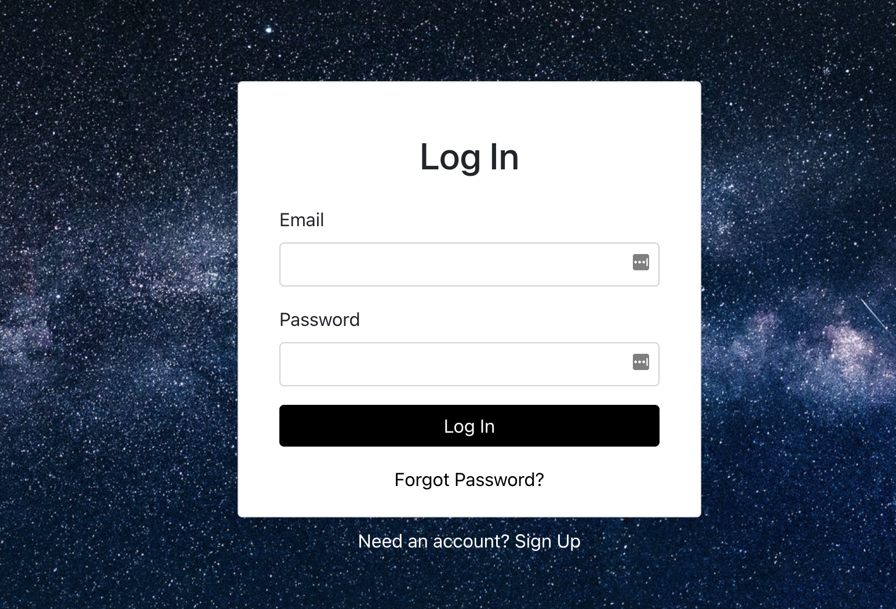
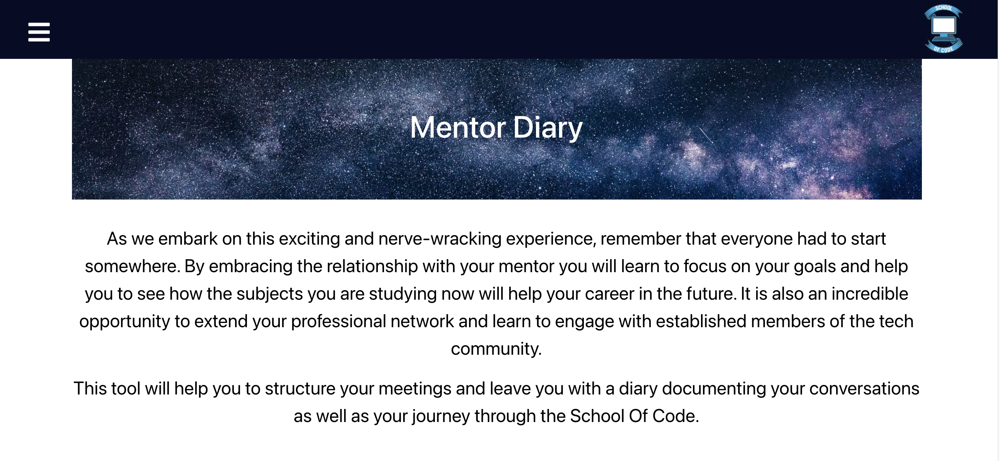
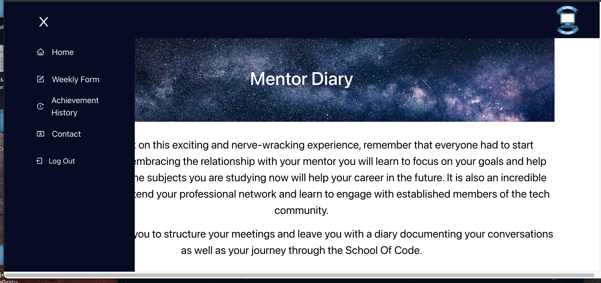

# Project Week

Our mid-way project on the School of Code Bootcamp. In teams of 4 we worked to create an app to make our mentoring experience better. We created a diary using a Node/Express server and Postgres database. The front-end was created using React with bootstrap used to style the app. The user can signup to access the app using Google Firebase with an email/password login.

